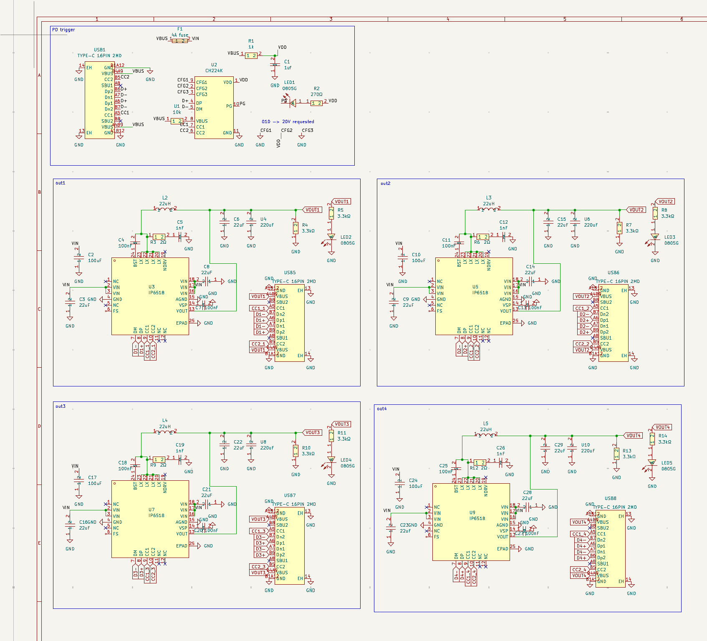
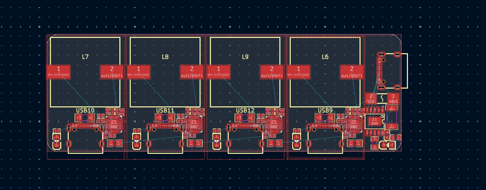
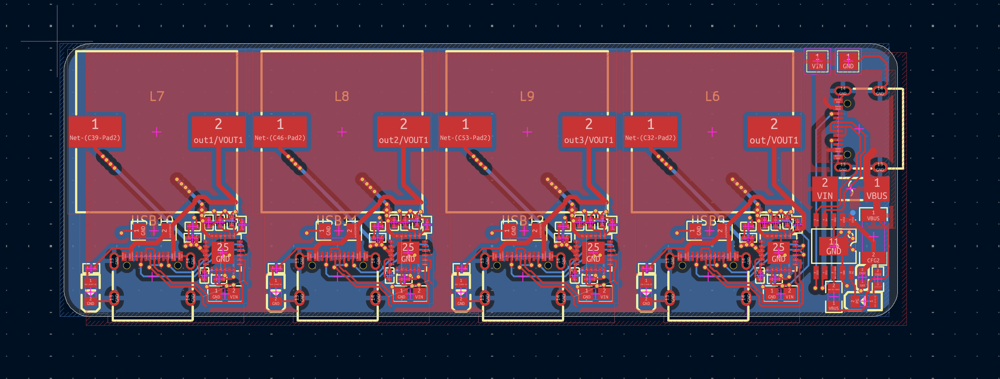

# Aug 17: Getting started

Got a rec from a peer to use IP6518. Architecture is:

- PD trigger in, else supply some lines
- IP6518 out per port

How many ports do I want? Probably more than two, but more than six seems excessive. Four is probably a good target for now.

Might buy a dedicated brick later, but charging off of laptop is fine for now, I guess.

Should I auto boost to some standard 20v or 24v in case PEBKAC plugs in a charger with weak PD that can't supply 20v? Probably not. I know my bricks. If no PG, it simply won't work.

Found a datasheet at https://www.tinytronics.nl/product_files/004122_IP6518-datasheet.pdf , schematic on page 8.

Yeah, made the rest of the design, copied it four times and changed the labels. Inductor sourcing was exciting but not too tricky. Ended up just putting one fuse. And I think LEDs for each is good UX. 

Time spent: 0.93 hours

# Aug 17: first pass on routing

QoL on the schematic, made it subsheets.

Got started on the layout!

I learned the "Multichannel" tooling in Kicad, which simplified things. This way I only have to place and route once!!

Finished placement 

aand finished routing. Man, it's so satisfying to click "repeat layout"

DRC was pretty minor, actually. Just one or two poorly placed vias, then bumped the clearance down to 0.15mm because jlc goes down to 0.09 or whatever. Ignore the annular width, that's irrelevant (easyeda2kicad footprints, I know)

But uh yeah!

Time tracking:

started 5:04 pm

ended 5:34

resumed 6:08

Ended 7:18

Time spent: 1.66 hours
