# Aug 17: Getting started

Got a rec from a peer to use IP6518. Architecture is:

- PD trigger in, else supply some lines
- IP6518 out per port

How many ports do I want? Probably more than two, but more than six seems excessive. Four is probably a good target for now.

Might buy a dedicated brick later, but charging off of laptop is fine for now, I guess.

Should I auto boost to some standard 20v or 24v in case PEBKAC plugs in a charger with weak PD that can't supply 20v? Probably not. I know my bricks. If no PG, it simply won't work.

Found a datasheet at https://www.tinytronics.nl/product_files/004122_IP6518-datasheet.pdf , schematic on page 8.

Yeah, made the rest of the design, copied it four times and changed the labels. Inductor sourcing was exciting but not too tricky. Ended up just putting one fuse. And I think LEDs for each is good UX. 

Time spent: 0.93 hours

# Aug 17: first pass on routing

QoL on the schematic, made it subsheets.

Got started on the layout!

I learned the "Multichannel" tooling in Kicad, which simplified things. This way I only have to place and route once!!

Finished placement 

aand finished routing. Man, it's so satisfying to click "repeat layout"

DRC was pretty minor, actually. Just one or two poorly placed vias, then bumped the clearance down to 0.15mm because jlc goes down to 0.09 or whatever. Ignore the annular width, that's irrelevant (easyeda2kicad footprints, I know)

But uh yeah!

Time tracking:

started 5:04 pm

ended 5:34

resumed 6:08

Ended 7:18

Time spent: 1.66 hours

# Aug 17: sk polish and render

Time tracking:
- Started 7:18
- Ended 7:54

Added a b.silkscreen, played around a little bit, and made a blender render!

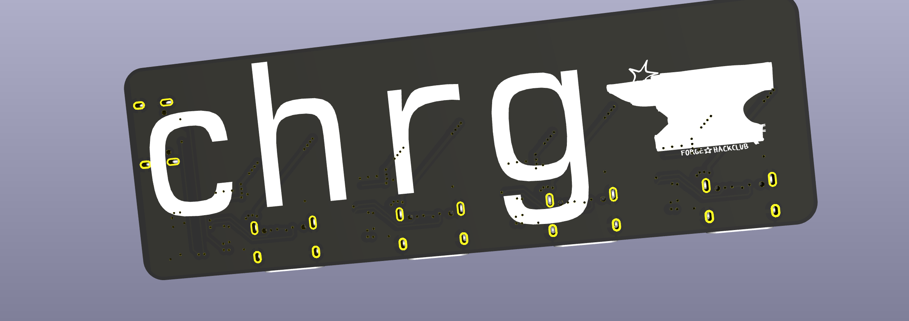

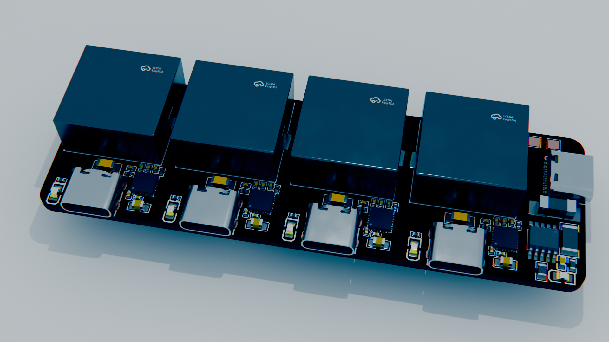

I think the blue color grading is cool. 

Honestly atp most design work was fun. Kind of a speedrun lol. I guess I'll write docs and stuff and see how my design review goes. 

Time spent: 0.61 hours

# Aug 18: README skeleton

Started in on the README. Fun to write. Probably my next step is to actually get a quote off of JLC and then polish off any and all requirements

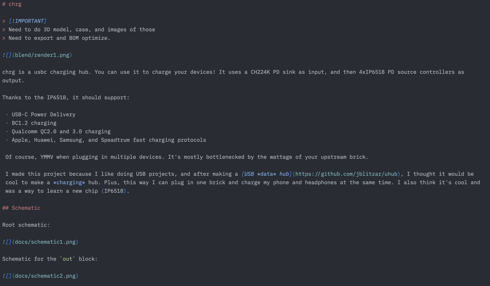

Time spent: 0.3 hours

# Aug 18 BOM opt

Starting price for PCBA was $100 (zamn)

Started with the low-hanging-fruit Basic substitutions.

  - C1592 -> C15849
  - C131394 -> C1525
  - C14442 -> C1523
  - C137992 -> C25890
  - C2907219 -> C17414

Just those subs will bring PCBA cost down to 83.

  
And other substitutions that change footprint that I'll still make:

 - Use C59461 for the 22uF
 - use C15008 for the 100uF
 - use C22977 for the 2ohm

 Got sort of midway through the refactor.

 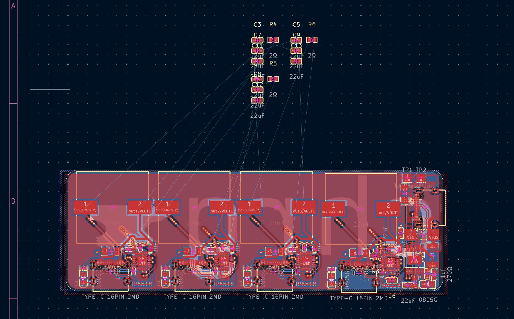

 
Time tracking:
 - started 8pm
 - Ended 8:52

Gonna deflate a little bit.

Time spent: 0.5 hours

# August 19 refactor

Placed the rest of the big caps, small session today. I might do a bit more later I guess. Only minor battles with DRC. tbd if the easyeda2kicad footprints are sus. Also deleted the test points because I can always desolder the global 100uf and use those as bodge pads. 

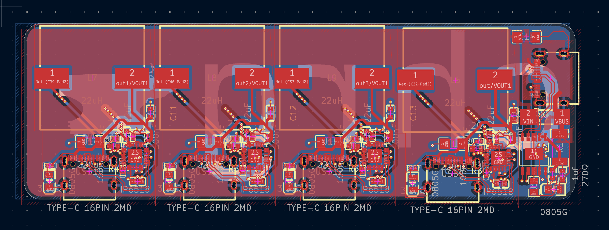

Time spent: 0.25 hours

# August 20: Made it manufacturable and only committed one aesthetic atrocity

Because easyeda2kicad footprints suck, I have to make sure clearances acc work. Moved around some caps, clicked repeat layout. 

Only ONE weirdly tilted component lol

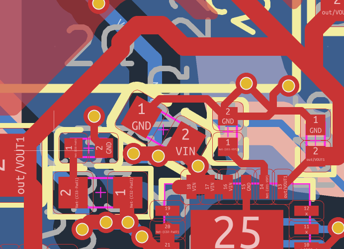

Time spent: 0.25 hours

# August 20: Aggressive BOM opt

Time for some intelligent component swapping.

Nuked the 220uFs. Now just one global 100uF.

There is only one LED resistor value, 3.3k.

Now PCBA cost is down to $57 !

genuinely BOM is starting to be irreducable. Actually cheap components matter.

Eating BOM:
 - inductors (see if can source better?? TBD)
 - IP6518 (the cheapest there is on LCSC, 8pcs genuinely is $12)
 - 1k ch224k resistor is extended, can probably source better

 Dicey stuff:
  - see if need fuse?
  - see if need CR decoupling on the 22uh vout line?

Found C364085 as a different inductor, should shave another $8.

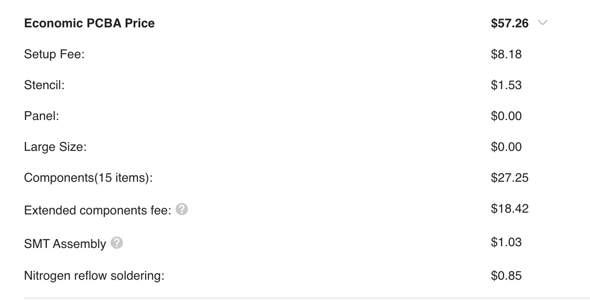

Time spent: 1 hour

# August 21: Swapped the inductor, cleaned routing

Yeah! Made some thicker traces. this inductor is cheaper and smaller. It does have 3x the DCR, but that's okay I guess. It does change the look a bit too though.

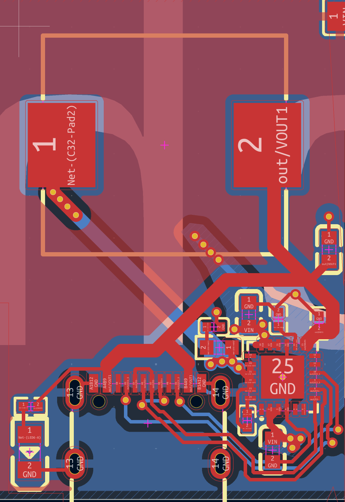
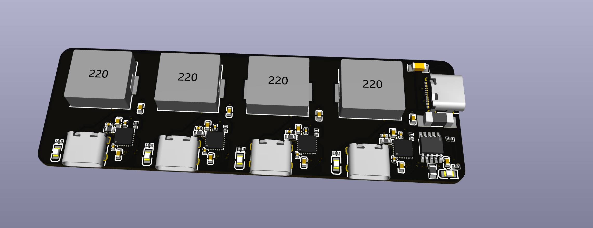

Then I re-exported for the blender render. Spent a bit trying to get the colors right.

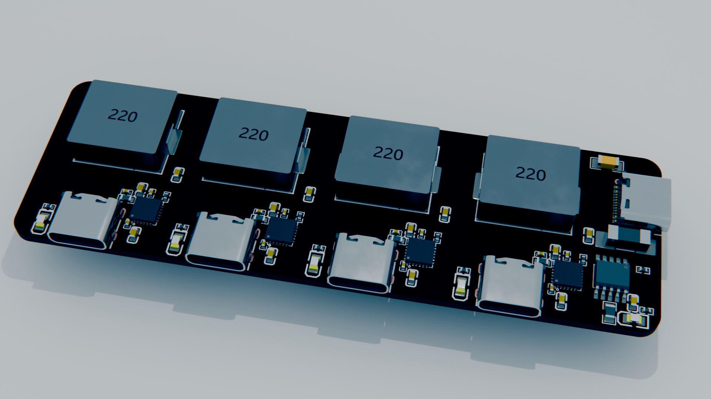

Then I got another quote. Guess how much PCBA costs now??

That's right, $45 !!!

That is very much down from $100.

Since this is p much finalized / irreducable, I made the BOMs.

Time tracking
 - Started 4:20
 - ended 5:10
 - resumed 5:52
 - ended 6:02

Time spent: 1 hour

# August 21: messed around

I guess I will do a case after all.

Messed around with silkscreen, ended up just keeping the anvil and qr code in the end

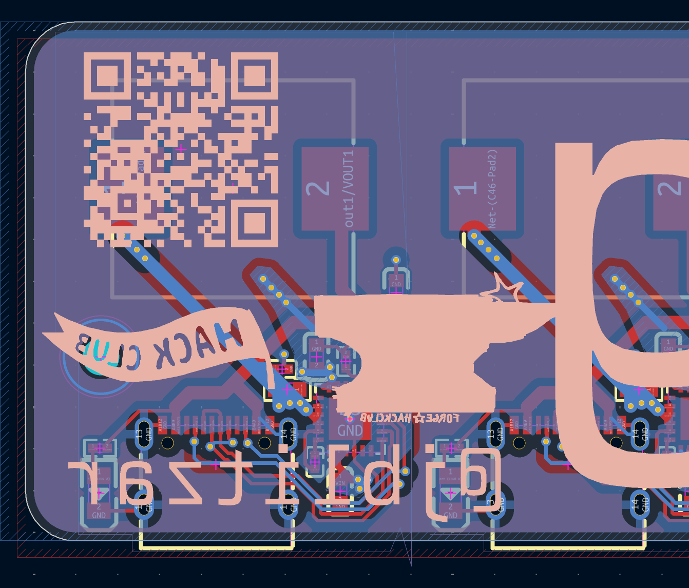

And then I added mounting holes!! They are M2 because M3 was inconvenient to place. I can get m2 screws or use m2 3d printed fingers.

The triangle placement is pretty aura if i do say so myself

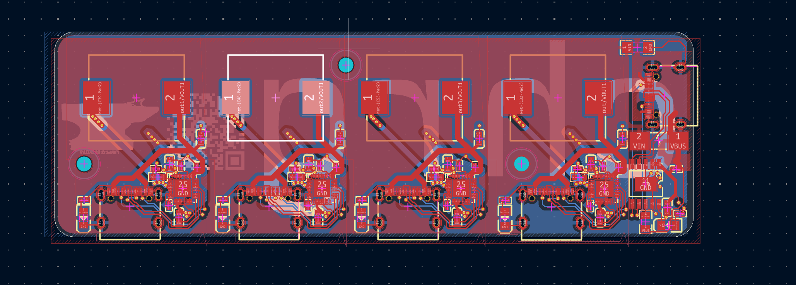

Time spent: 0.3 hours

# August 22: Case

I made a case in Onshape. Chamferred the edges, added the holes. Internal fillet for structural integrity. Not much more to say I guess, this is how making enclosures goes?

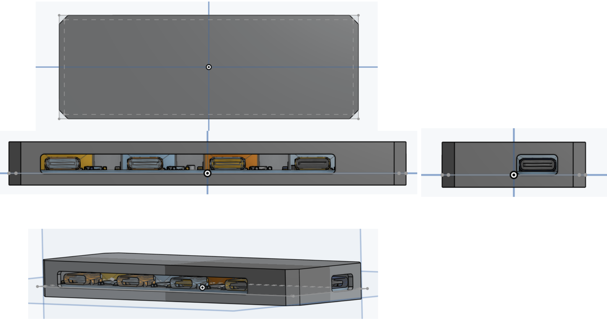

Time spent: 1 hour

# August 23: Submission requirements

Went through the submission requirements, updated the README. Then I went through the elite review checklist requirements.

Added a hole in my case to make it actually assembleable 💀 

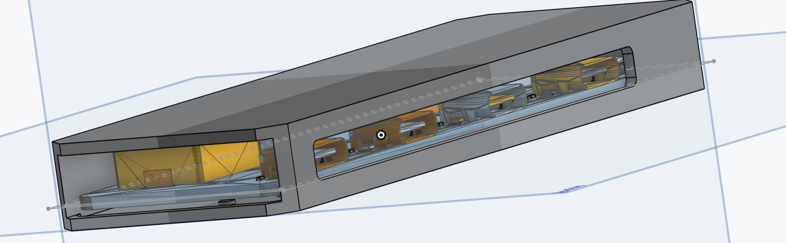

Time spent: 0.5 hours
