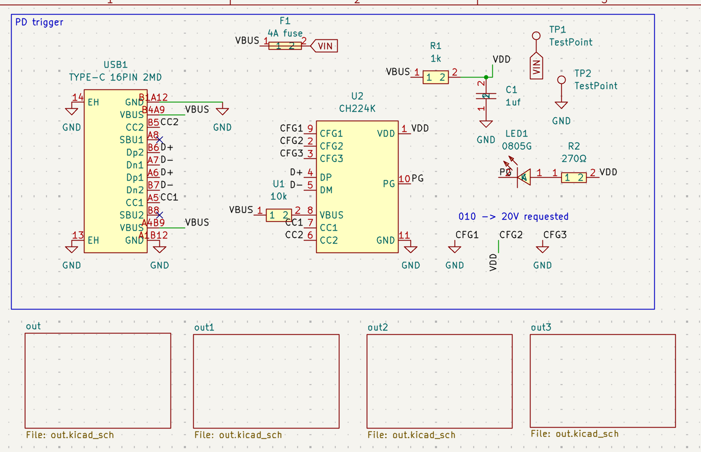
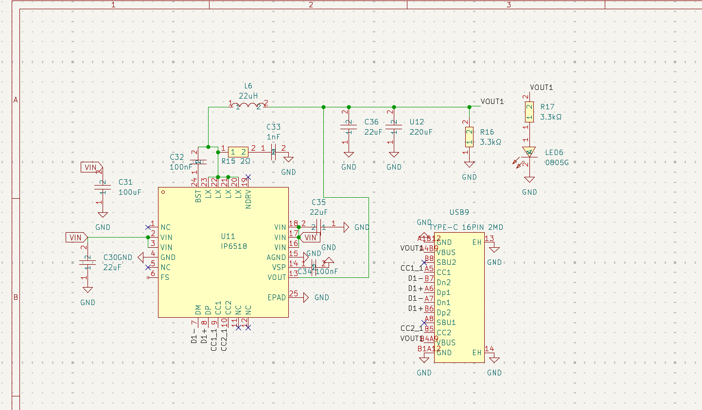
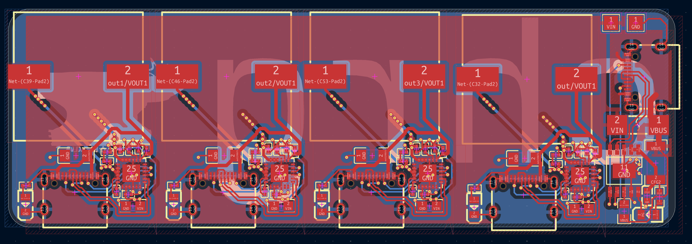

# chrg

> [!IMPORTANT]
> Need to do 3D model, case, and images of those
> Need to export and BOM optimize. 

chrg is a usbc charging hub. You can use it to charge your devices! It uses a CH224K PD sink as input, and then 4xIP6518 PD source controllers as output. 

Thanks to the IP6518, it should support:

 - 45W
 - USB-C Power Delivery
 - BC1.2 charging
 - Qualcomm QC2.0 and 3.0 charging
 - Apple, Huawei, Samsung, and Spreadtrum fast charging protocols

 Of course, YMMV when plugging in multiple devices. It's mostly bottlenecked by the wattage of your upstream brick (or alternatively 45W as the ip6518 spec says).

 I made this project because I like doing USB projects, and after making a [USB *data* hub](https://github.com/jblitzar/uhub), I thought it would be cool to make a *charging* hub. Plus, this way I can plug in one brick and charge my phone and headphones at the same time. I also think it's cool and was a way to learn a new chip (IP6518).

## Schematic

Root schematic:

Schematic for the `out` block:

## PCB

[View on Kicanvas](https://kicanvas.org/?repo=https%3A%2F%2Fgithub.com%2FJBlitzar%2Fchrg%2Ftree%2Fmain%2FPCB%2Fchrg)

## Testimonials

Don't just take it from me! Hear what users are saying about chrg

> *What are you making...*

> *this shit is not passing tsa bro*

> *Scary*

## BOM

|Item                                              |link                               |Cost|Notes           |
|--------------------------------------------------|-----------------------------------|----|----------------|
|5x PCB (moq)                                      |N/A                                |4   |JLC             |
|2x PCBA (moq)                                     |N/A                                |45.87|JLC             |
|JLC shipping + taxes                              |N/A                                |8   |                |
|Total                                             |N/A                                |57.87|                |

### Fabrication BOM

Other fabrication outputs at [PCB/chrg/production](PCB/chrg/production)

|Designator                                        |Footprint                          |Quantity|Value           |LCSC Part #|
|--------------------------------------------------|-----------------------------------|--------|----------------|-----------|
|C1                                                |C0603                              |1       |1uf             |C15849     |
|C10, C11, C12, C13, C2, C3, C4, C5, C6, C7, C8, C9|C0603                              |12      |22uF            |C59461     |
|C14                                               |C1206                              |1       |100uF           |C15008     |
|C32, C34, C39, C41, C46, C48, C53, C55            |C0402                              |8       |100nF           |C1525      |
|C33, C40, C47, C54                                |C0402                              |4       |1nF             |C1523      |
|F1                                                |FUSE-SMD_2410-T4A-125V             |1       |4A fuse         |C5220739   |
|L1, L2, L3, L4                                    |IND-SMD_L14.4-W12.8                |4       |SLO1350H220MTT  |C364085    |
|LED1, LED6, LED7, LED8, LED9                      |LED0805-R-RD                       |5       |0805G           |C2297      |
|R16, R17, R19, R20, R21, R22, R23, R25, R26       |R0402                              |9       |3.3kΩ           |C25890     |
|R2                                                |R0402                              |1       |1k              |C11702     |
|R3, R4, R5, R6                                    |R0603                              |4       |2Ω              |C22977     |
|U1                                                |R0805                              |1       |10k             |C17414     |
|U11, U13, U15, U17                                |QFN-24_L4.0-W4.0-P0.50-BL-EP2.6    |4       |IP6518          |C181688    |
|U2                                                |ESSOP-10_L4.9-W3.9-P1.0-LS6.0-TL-EP|1       |CH224K          |C970725    |
|USB1, USB10, USB11, USB12, USB9                   |USB-C-SMD_TYPE-C-16PIN-2MD-073     |5       |TYPE-C 16PIN 2MD|C2765186   |
